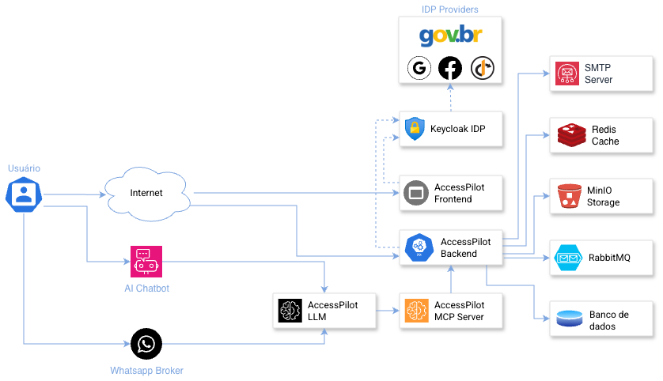

    

        <picture>
          <source media="(prefers-color-scheme: dark)" srcset=".img/accesspilot-logo-w.svg">
          <source media="(prefers-color-scheme: light)" srcset="img/accesspilot-logo.svg">
          
        </picture>

        

            Um produto <a href="https://github.com/getInsight-it" target="_blank" rel="noreferrer" style="color: black; text-decoration: underline">getInsight</a>
        

    

    

        
        
        
        
        
        
        
        
        
    

---

Imagine que você precisa de acesso a um sistema importante para realizar seu trabalho. No passado, isso significava enviar e-mails, preencher formulários em papel, esperar semanas por uma resposta e, muitas vezes, nem saber em que etapa sua solicitação estava. O AccessPilot foi criado para transformar essa experiência.

O AccessPilot é uma plataforma digital que centraliza todo o processo de solicitação e aprovação de acessos a sistemas. Pense nele como um portal onde você pode, de forma simples e transparente, pedir os acessos que precisa, acompanhar o andamento da sua solicitação em tempo real e receber notificações sobre cada etapa do processo. Para os gestores, é uma ferramenta que permite tomar decisões informadas sobre quem deve ter acesso a quê, sempre com total rastreabilidade e justificativas documentadas.

Desenvolvido especialmente para atender as necessidades de órgãos públicos e também de empresas privadas, o sistema garante que cada concessão de acesso seja transparente, auditável e esteja em conformidade com as normas de segurança da informação. Tudo o que acontece no AccessPilot fica registrado: quem solicitou, quando solicitou, por que precisa do acesso, quem aprovou e quando aprovou. Isso não apenas facilita o dia a dia, mas também prepara a organização para auditorias e garante a conformidade com políticas de segurança.

**Conheça o Access Pilot:**
o copiloto inteligente da sua gestão de acessos. Todos os usuários, logins e permissões em um só lugar.

- Automação com IA Inteligente: Cadastre e revogue acessos em segundos, detecta riscos e comportamentos fora do padrão automaticamente com IA;
- Integrações Nativas: Compatível com Gov.BR, Keycloak, Azure AD, Google Workspace, Auth0 e muito mais;
- Segurança com Visão 360º: Controle granular e alertas automáticos de anomalias. Saiba quem acessa o quê, quando  e porquê;
- Controle de Acesso Seguro: Implemente medidas robustas de segurança para proteger seus dados e recursos sensíveis contra acessos não autorizados;
- Acesso Baseado em Funções: Gerencie permissões de usuários com facilidade, criando funções e níveis de acesso personalizados conforme suas necessidades;
- Monitoramento de Atividades: Acompanhe e analise as atividades dos usuários com relatórios abrangentes e ferramentas de auditoria em tempo real;
- Controle de Acesso Descentralizado: Dê autonomia às equipes com gestão distribuída, mantendo ao mesmo tempo supervisão central e controle administrativo;
- Gestão Hierárquica de Perfis: Crie e gerencie estruturas organizacionais complexas com papéis aninhados e herança de permissões;
- Gestão de Autoinscrição: Facilite o onboarding de usuários com fluxos de autoinscrição personalizáveis e processos de aprovação automatizados.

### Arquitetura

O Access Pilot é uma aplicação [_cloud native_](https://github.com/cncf/toc/blob/main/DEFINITION.md), com clara separação entre _backend_, _frontend_ e serviços integrados.

### Hein!?

Nada melhor que uma imagem...

#### Componentes

Esses são os componentes que você, em breve, poderá acessar:

- Backend
- Frontend
- MCP Server
- LLM Service

## Como contribuir?

Para contibuir com o projeto, começe lendo as orientações do [CONTRIBUTING.md](CONTRIBUTING.md). Além disso, esperamos que todos os participantes da comunidade cumpram nosso [Código de Conduta](CODE_OF_CONDUCT.md). Por favor, leia-o e siga-o.

## Licença

O Access Pilot e todos os seus derivados estão licenciados sob os termos da licença [Apache v2.0](LICENSE).